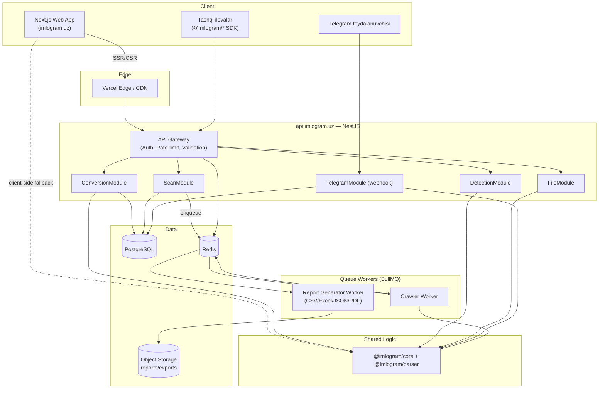

# 4. System Architecture

## Tanlangan stek (aniqlangan)

- **Web** — Next.js 14+ (App Router, RSC), TypeScript, Tailwind, shadcn/ui.
- **Backend API** — **NestJS** (modulli monolit, keyinchalik kerak bo'lsa mikroservisga
  bo'linadigan tuzilmada), TypeScript.
- Web va API alohida deploy birliklari; ular orasidagi yagona umumiy mantiq
  `@imlogram/core` orqali (ikkalasi ham shu paketni import qiladi — mantiq ikki marta
  yozilmaydi).

## Yuqori darajadagi komponentlar

## Komponentlar tavsifi

### Web (Next.js)
- App Router, React Server Components — SEO-muhim sahifalar (landing, docs) server-side
  render qilinadi.
- Converter/Detector UI **client-side birinchi**: `@imlogram/core` brauzerga bundlangan,
  API faqat tarix saqlash, ulashish linklari va autentifikatsiya talab qiladigan holatlar
  uchun chaqiriladi. Bu offline-first va tezlikni ta'minlaydi (FR-WEB-03).

### API (NestJS)
- Modulli monolit: `ConversionModule`, `DetectionModule`, `ScanModule`, `FileModule`,
  `TelegramModule`, `AuthModule`, `ApiKeyModule`.
- Har bir modul: `controller` (HTTP sirt) → `service` (biznes mantiq) → `@imlogram/core`
  (sof funksiyalar). NestJS qatlami faqat orkestratsiya, validatsiya (class-validator/zod),
  auth va persistence uchun javobgar — konvertatsiya mantig'ining o'zi emas.
- `ScanModule` og'ir ishni to'g'ridan-to'g'ri bajarmaydi — BullMQ orqali `Workers`
  ilovasiga (alohida NestJS `standalone application` yoki alohida process) topshiradi, shu
  bilan API javob berish tezligi crawl uzunligiga bog'liq bo'lib qolmaydi.

### Workers
- `apps/workers` — NestJS standalone (HTTP sirtisiz), faqat BullMQ processor’lar.
- `CrawlerProcessor` — bitta sahifani oladi, fetch qiladi, matnni ajratadi, `@imlogram/core`
  bilan detect qiladi, natijani Postgres’ga yozadi va navbatdagi ichki linklarni qo'shadi.
- `ReportProcessor` — job tugagach CSV/Excel/JSON/PDF generatsiya qilib S3-mos storage’ga
  yuklaydi, presigned URL qaytaradi.

### Telegram Bot
- `TelegramModule` NestJS ichida **webhook** sifatida ishlaydi (alohida process emas) —
  shu orqali auth, rate-limit va `@imlogram/core` bilan bir xil kod bazasi ishlatiladi.
  Yuqori yukda alohida `apps/bot` processiga ajratish mumkin (v2.0, §20).

### Ma'lumotlar qatlami
- **PostgreSQL** — foydalanuvchilar, API kalitlar, scan job/finding, konvertatsiya tarixi
  (Prisma ORM, §7).
- **Redis** — rate-limit (token bucket), BullMQ queue backend, qisqa muddatli cache
  (masalan robots.txt cache).
- **Object storage** (S3-mos, masalan Cloudflare R2) — scan hisobotlari, yuklangan fayllar.

## Deploy topologiyasi (yuqori darajada)

| Komponent | Muhit | Eslatma |
|---|---|---|
| `apps/web` | Vercel | Next.js uchun native, Edge/ISR imkoniyatlari |
| `apps/api` (NestJS) | Docker konteyner → Fly.io/Render/AWS ECS | Autoscale, health-check `/health` |
| `apps/workers` | Docker konteyner, alohida scale guruh | CPU-intensive crawl/report uchun |
| PostgreSQL | Managed (Neon/RDS/Supabase) | Avtomatik backup |
| Redis | Managed (Upstash/Redis Cloud) | BullMQ uchun persistence yoqilgan |
| `docs.imlogram.uz` | Vercel (alohida Next.js/Nextra app) | |
| `status.imlogram.uz` | Alohida yengil xizmat yoki 3-tomon (Instatus) | |

## Nega modulli monolit (mikroservis emas)

MVP/v1 bosqichida jamoat kichik, operatsion murakkablikni minimallashtirish ustuvor.
NestJS modullari aniq chegaralar bilan yoziladi (har bir modul o'z DTO, service, repository
qatlamiga ega) — shu bois kerak bo'lganda (masalan `ScanModule` yukning katta qismini
tashkil qilsa) uni alohida xizmatga ajratish keyinchalik kod tuzilmasini qayta yozishni
talab qilmaydi, faqat deploy chegarasini ko'chirishni talab qiladi.
