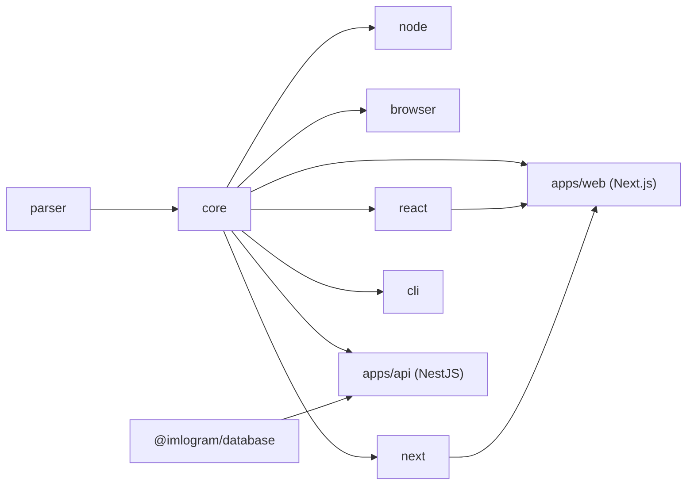

# 5. Monorepo Structure

TurboRepo + pnpm workspaces. Bitta repo — barcha `apps/*` va `packages/*`.

```
imlogram/
├── apps/
│   ├── web/              # Next.js — imlogram.uz
│   ├── api/               # NestJS — api.imlogram.uz
│   ├── workers/           # NestJS standalone — BullMQ processorlar
│   ├── docs/               # Next.js/Nextra — docs.imlogram.uz
│   └── status/             # Yengil status sahifasi — status.imlogram.uz
│
├── packages/
│   ├── core/                # @imlogram/core — asosiy konvertatsiya mantig'i
│   ├── parser/              # @imlogram/parser — segmentatsiya/tokenizer (core ichidan foydalanadi)
│   ├── node/                # @imlogram/node — Node-specific (fs, stream) helperlari
│   ├── browser/             # @imlogram/browser — Web Worker/Clipboard helperlari
│   ├── react/                # @imlogram/react — hook va komponentlar
│   ├── next/                 # @imlogram/next — middleware/route handler helperlari
│   ├── cli/                  # @imlogram/cli — terminal vositasi
│   ├── ui/                   # Ichki shared UI kit (shadcn/ui asosida, apps/web va docs uchun)
│   ├── config-eslint/        # Umumiy ESLint config
│   ├── config-typescript/    # Umumiy tsconfig bazalari
│   └── database/             # Prisma schema + client (@imlogram/database, faqat apps/api va workers uchun)
│
├── docs/
│   └── spec/                 # Ushbu spetsifikatsiya hujjatlari
│
├── .github/
│   └── workflows/            # CI/CD (§17)
│
├── turbo.json
├── pnpm-workspace.yaml
├── package.json
├── tsconfig.base.json
├── .changeset/
└── README.md
```

## `pnpm-workspace.yaml`

```yaml
packages:
  - "apps/*"
  - "packages/*"
```

## `turbo.json` (asosiy g'oya)

```jsonc
{
  "$schema": "https://turbo.build/schema.json",
  "tasks": {
    "build": { "dependsOn": ["^build"], "outputs": ["dist/**", ".next/**"] },
    "lint": { "dependsOn": ["^build"] },
    "test": { "dependsOn": ["^build"] },
    "typecheck": { "dependsOn": ["^build"] },
    "dev": { "cache": false, "persistent": true }
  }
}
```

## Bog'liqlik grafigi (paketlar orasida)



`@imlogram/core` — yagona "haqiqat manbai". Boshqa hech bir paket konvertatsiya qoidalarini
takrorlamaydi; ular faqat runtime-specific qulayliklar (fayl o'qish, clipboard, React hook)
qo'shadi.

## Umumiy vositalar

| Vosita | Vazifa |
|---|---|
| pnpm | Paket menejeri, workspace |
| TurboRepo | Task orchestration, remote cache |
| Changesets | Versiyalash va CHANGELOG (§18) |
| tsup | Har bir paketni CJS+ESM+d.ts qilib build qilish |
| Vitest | Unit/integration testlar |
| Playwright | E2E testlar (`apps/web`) |
| ESLint + Prettier | Kod sifati (umumiy config `packages/config-eslint`) |
| Husky/lefthook + commitlint | Pre-commit va Conventional Commits |
