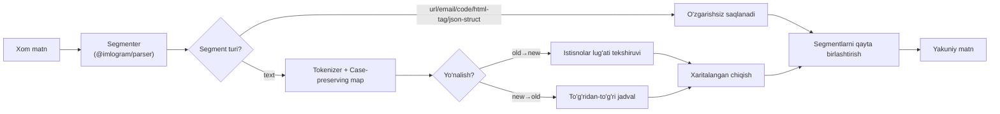

# 9. Conversion Algorithm

## 9.1 Umumiy oqim



## 9.2 Pseudocode

```ts
function convert(input: string, direction: "old_to_new" | "new_to_old"): ConversionResult {
  const segments = segmenter.parse(input);   // §8.2
  const output: string[] = [];
  const changes: Change[] = [];               // audit uchun: {start, end, from, to}

  for (const seg of segments) {
    if (seg.kind !== "text") {
      output.push(seg.raw);
      continue;
    }

    const { text, segmentChanges } =
      direction === "old_to_new"
        ? tokenizeOldToNew(seg.raw, seg.start)
        : tokenizeNewToOld(seg.raw, seg.start);

    output.push(text);
    changes.push(...segmentChanges);
  }

  return {
    text: output.join(""),
    direction,
    changes,
    stats: computeStats(changes),
  };
}
```

## 9.3 Ikki yo'nalishning assimetriyasi

Bu bo'limning eng muhim texnik haqiqati: **ikki yo'nalish bir xil murakkablikda emas.**

### Yangi → Eski (oson, bijektiv)

```
Ö → Oʻ   ö → oʻ   Ğ → Gʻ   ğ → gʻ   Ş → Sh   ş → sh   Ç → Ch   ç → ch
```

Har bir yangi belgi **aniq bitta** eski ekvivalentiga ega — hech qanday noaniqlik yo'q,
lug'atga hojat yo'q, sof jadval-lookup, O(n) va 100% deterministik. Bu yo'nalish uchun
round-trip kafolatlanadi: `toOld(toNew(oldText)) === oldText` faqat agar `oldText` allaqachon
kanonik apostrof bilan yozilgan bo'lsa (turli apostrof variantlari kanonik shaklga
normallashtiriladi — bu **lossy** normalizatsiya, lekin semantik jihatdan to'g'ri, chunki
barcha variantlar bir xil tovushni bildiradi).

### Eski → Yangi (qiyin, kontekstga bog'liq)

`sh`/`ch` digraf yoki ikkita mustaqil undosh ekanligi faqat so'z darajasida (ba'zan morfema
chegarasi bilimisiz) aniqlanadi. Algoritm:

1. So'zni bo'shliq/tinish belgilari bo'yicha ajratadi (`\p{L}+` Unicode-aware regex).
2. So'zni kichik harfga o'tkazib istisnolar lug'atida qidiradi.
3. Agar topilsa — lug'atda ko'rsatilgan aniq bo'linish qo'llaniladi.
4. Agar topilmasa — standart digraf qoidasi qo'llaniladi (statistik jihatdan to'g'ri
   ehtimollik yuqori: o'zbek tilida `sh`/`ch` ketma-ketligining katta ko'pchiligi haqiqiy
   digraf).

Bu — **many-to-one bilan kurashish uchun exception-list bilan boyitilgan greedy algoritm**
strategiyasi: to'liq lingvistik tahlilchi (morfologik parser) qurish o'rniga, chegara
holatlarni community-maintained lug'at bilan qamrab olish. MVP uchun bu yetarli va
kengaytiriladigan; kelajakda (v2.0+) statistik til modeliga o'tish imkoniyati ochiq
qoldiriladi (`ConversionOptions.strategy: "dictionary" | "ml"`), lekin bu spets doirasidan
tashqarida.

## 9.4 Murakkablik

- Vaqt: **O(n)**, bitta segmentatsiya o'tishi + bitta tokenizatsiya o'tishi (istisnolar
  lug'ati hash-map lookup, O(1) amortizatsiyalangan).
- Xotira: **O(n)** — chiqish buferi kirish bilan bir xil tartibda.
- Istisnolar lug'ati: kompilyatsiya vaqtida `Set`/`Map` ga yuklanadi, runtime’da fayl
  o'qish yo'q (bundle ichiga singdirilgan).

## 9.5 `ConversionResult` interfeysi

```ts
interface Change {
  start: number;
  end: number;
  from: string;
  to: string;
  reason: "digraph" | "apostrophe" | "exception-skip";
}

interface ConversionResult {
  text: string;
  direction: "old_to_new" | "new_to_old";
  changes: Change[];          // audit/highlight uchun (masalan Detector UI'da)
  stats: {
    charCount: number;
    wordCount: number;
    changedCount: number;
    readingTimeSec: number;
  };
}
```

`changes` massivi UI’da "nima o'zgardi" ni vizual belgilash (masalan diff highlight) va
Detector modulida foydalaniladi (§FR-DET-02).

## 9.6 Sinov strategiyasi bilan bog'liqlik

Har bir qoida (§8.1 jadvali, apostrof variantlari, istisnolar) fixture-based test holati
sifatida `packages/core/test/fixtures/*.json` da saqlanadi — bu 1000+ test talabining (§16)
asosiy manbai bo'ladi.
