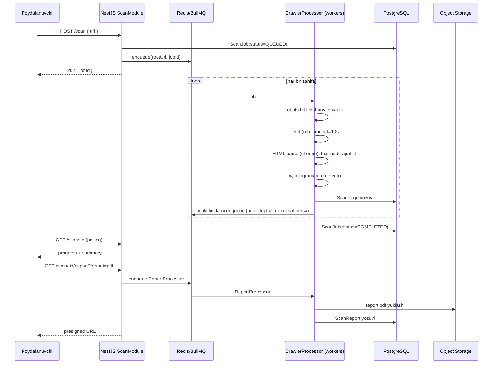

# 10. Website Scanner Architecture

## Oqim



## Crawler siyosati (politeness)

| Qoida | Qiymat |
|---|---|
| `robots.txt` | Har doim hurmat qilinadi; `Disallow` qilingan yo'llar o'tkazib yuboriladi |
| `Crawl-delay` | robots.txt’dan olinadi, aks holda domen-bo'yicha default 500ms |
| Concurrency | Bitta domen uchun max 2 parallel so'rov |
| User-Agent | `ImlogramBot/1.0 (+https://imlogram.uz/bot)` — identifikatsiya qilinadi |
| Max depth | Default 3, konfiguratsiya qilinadi (max 6) |
| Max pages | Default 200, hisob turiga qarab yuqori limit (v1.5+ pricing) |
| Timeout/sahifa | 10s, 3 marta qayta urinish (exponential backoff) |
| Domen chegarasi | Faqat kiritilgan domen (va subdomenlar, ixtiyoriy flag) — tashqi domenga chiqilmaydi |
| Fayl turlari | Faqat `text/html`; PDF/rasm/video o'tkazib yuboriladi (v2.0’da PDF matn qazib olish) |

SSRF va boshqa xavfsizlik cheklovlari §15.3 da batafsil.

## Sahifa ichidan matn ajratish

1. HTML fetch qilinadi, `cheerio` bilan parse qilinadi.
2. `<script>`, `<style>`, `<noscript>`, `<template>` konteynerlari butunlay chiqarib
   tashlanadi.
3. Quyidagi manbalar alohida tekshiriladi va natijada ajratiladi:
   - `title`
   - `meta[name=description]`, `meta[property=og:description]`
   - Body matn tugunlari (DOM text node’lar, tag ichidagi HTML emas)
4. Har bir manba `@imlogram/core` `detect()` funksiyasiga yuboriladi → eski/yangi/aralash
   + harf-bo'yicha son.
5. Sahifa natijalari `ScanPage.letterCounts` (Json) va `hasOldScript` bool sifatida
   saqlanadi.

## Natija strukturasi (`GET /scan/:id`)

```json
{
  "jobId": "clx...",
  "status": "COMPLETED",
  "rootUrl": "https://example.uz",
  "pagesScanned": 84,
  "pagesWithOldScript": 31,
  "letterTotals": { "sh": 412, "ch": 198, "oʻ": 77, "gʻ": 53 },
  "pages": [
    {
      "url": "https://example.uz/haqida",
      "title": "Biz haqimizda",
      "hasOldScript": true,
      "letterCounts": { "sh": 12, "ch": 4 }
    }
  ]
}
```

## Eksport formatlari

| Format | Vosita | Mazmuni |
|---|---|---|
| CSV | `csv-stringify` (streaming) | Sahifa-bo'yicha jadval: url, status, hasOldScript, harf sonlari |
| Excel | `exceljs` | CSV bilan bir xil ma'lumot + formatlash, xulosa varag'i |
| JSON | native | To'liq struktura, dasturchilar uchun |
| PDF | `@react-pdf/renderer` yoki Puppeteer HTML→PDF | Rasmiy hisobot ko'rinishi: logo, sana, xulosa grafik, top-10 sahifa |

Barcha eksport ishlari `ReportProcessor` (BullMQ) orqali asinxron bajariladi — katta saytlar
(200 sahifa) uchun ham API javob berish tezligi ta'sirlanmaydi. Natija S3-mos storage’ga
yuklanadi, foydalanuvchiga presigned URL (24 soat amal qiladi) qaytariladi.

## Cheklovlar va suiiste'mol oldini olish

- Bir xil `rootUrl` uchun 10 daqiqalik cool-down (FR-SCAN-08).
- Anonim foydalanuvchilar uchun kuniga 3 ta scan, ro'yxatdan o'tganlar uchun 20 ta
  (Redis token bucket, `userId`/IP bo'yicha).
- Katta saytlar uchun (`maxPages` limitidan oshganda) job "partial" status bilan yakunlanadi
  va foydalanuvchiga xabar beriladi — jimgina kesib tashlanmaydi.
