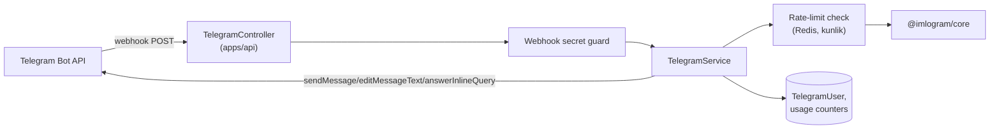

# 11. Telegram Bot Architecture

## Texnologiya

- **grammY** (TypeScript-first, Telegraf’ga qaraganda yengilroq va tip-xavfsiz) kutubxonasi.
- Bot NestJS `TelegramModule` ichida **webhook** rejimida ishlaydi (`apps/api` bilan bir
  process, §4) — polling emas, chunki webhook production’da resurs-samarali va NestJS’ning
  mavjud auth/rate-limit infratuzilmasidan foydalanadi.
- Webhook endpoint: `POST /telegram/webhook/:secret` (secret token Telegram
  `setWebhook`’dagi `secret_token` bilan tekshiriladi — spoofing’dan himoya).

## Komandalar

| Komanda | Vazifa |
|---|---|
| `/start` | Xush kelibsiz xabari + til tanlash |
| `/convert <matn>` | Avtomatik yo'nalishni aniqlab konvertatsiya qiladi |
| `/detect <matn>` | Yozuv turini va statistikani chiqaradi |
| `/stats` | Foydalanuvchining shu kungi/umumiy foydalanish statistikasi |
| `/lang` | Interfeys tilini o'zgartirish (uz/ru/en) |
| `/help` | Komandalar ro'yxati |

## Oddiy matn xabarlari (komandasiz)

Foydalanuvchi to'g'ridan-to'g'ri matn yuborsa:

1. Bot `detect()` chaqiradi (yozuv turini aniqlash).
2. Javob ostida inline tugmalar chiqadi:

```
[ Yangi alifboga o'tkazish ]   [ Eski alifboga o'tkazish ]
[ Statistika ]
```

3. Tugma bosilganda `callback_query` orqali natija **shu xabarni tahrirlab** (`editMessageText`)
   ko'rsatiladi — chat’ni xabarlar bilan to'ldirmaslik uchun.

## Inline mode

`@imlogram_bot matn shu yerda` — istalgan chatda yozilganda:

- Telegram `inline_query` yuboradi → bot `answerInlineQuery` bilan 2 ta natija qaytaradi:
  "Yangi alifboga" va "Eski alifboga" — foydalanuvchi birini tanlab xabar sifatida yuboradi.
- Debounce: Telegram o'zi so'rovlarni cheklaydi, lekin bot tarafida ham 300ms throttle
  qo'llaniladi ortiqcha `@imlogram/core` chaqiruvlarini oldini olish uchun.

## Arxitektura diagrammasi



## Sessiya va til

- Har bir Telegram foydalanuvchisi `TelegramUser` yozuviga ega (`telegramId` bo'yicha,
  §7-database). `languageCode` — bot javoblari uchun i18n kaliti.
- Anonim: hisob yaratish shart emas — bot faqat `telegramId` orqali ishlaydi. Agar
  foydalanuvchi veb-saytdagi hisobini ulashni istasa (`/link` komandasi — v1.5), bir martalik
  kod orqali `User.id` bilan bog'lanadi (tarixni sinxronlash uchun).

## Rate limiting va suiiste'mol oldini olish

- Kunlik 100 so'rov/foydalanuvchi (default, `TelegramUser.dailyUsage`, `usageResetAt` orqali
  har kuni 00:00 UTC+5’da qayta tiklanadi — cron worker).
- Xabar uzunligi cheklovi: 4096 belgi (Telegram limiti) — undan uzun matn "Iltimos faylni
  yuboring" degan taklif bilan `/file` oqimiga yo'naltiriladi (v1.5, fayl yuklash qo'llab-
  quvvatlansa).
- Flood control: grammY’ning built-in `sequentialize()` + o'z rate-limit middleware’i.

## Statistika (`/stats`)

```json
{
  "todayUsage": 12,
  "dailyLimit": 100,
  "totalConversions": 341,
  "mostUsedDirection": "old_to_new"
}
```

## Kelajakdagi kengaytmalar (v2.0, roadmap’da belgilangan)

- Guruh chatlarida avtomatik moderatsiya: guruh admin yoqsa, bot eski yozuvdagi xabarlarni
  avtomatik "taklif" sifatida javob beradi (spam qilmaydi, faqat so'ralganda).
- Fayl (`.docx`, `.txt`) yuborish orqali konvertatsiya.
